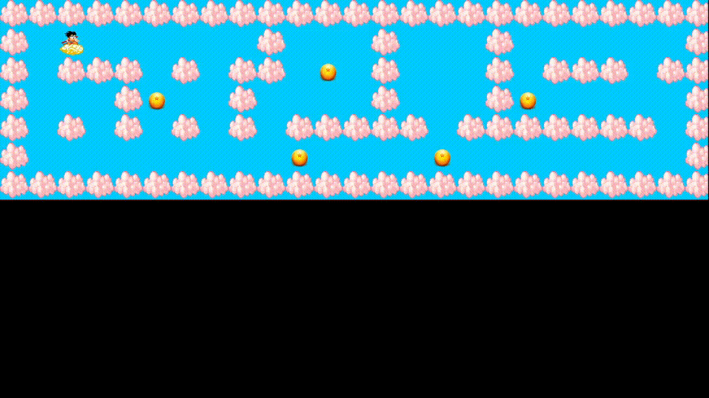

# so_long Dragon Ball Edition



## Descrição

Bem-vindo ao so_long Dragon Ball Edition! Este é um projeto que desenvolvi frente a um desafio da 42sp, uma versão emocionante do clássico jogo so_long, inspirado no incrível universo de Dragon Ball.

Neste jogo, você controla Goku em sua nuvem voadora, o Kinto'un, voando pelo céu em busca das esferas do dragão, enquanto enfrenta desafios emocionantes e aventuras eletrizantes!

## Biblioteca MLX42

Este projeto utiliza a biblioteca MLX42, uma poderosa ferramenta baseada na X11, desenvolvida pela comunidade da 42. A MLX42 oferece funcionalidades gráficas avançadas para criar jogos e aplicações visualmente impressionantes.

- **Instruções de Instalação**: Para mais informações sobre como instalar e utilizar a biblioteca MLX42, consulte [aqui](https://github.com/codam-coding-college/MLX42).

## Instalação

Siga estes passos simples para executar o jogo:

1. **Clone o Repositório:**
	```bash
	git clone git@github.com:gapima/so_long.git

2. **Compile o Projeto:**
	```bash
	make

3. **Execute o Jogo:**
	```bash
	./solong maps/nome_mapa

## Controles

- Setas direcionais: Movimentar Goku
- Esc: Fechar o jogo

## Comandos Makes
- Compilar:	
```bash 
make

## Screenshots

Aqui estão algumas capturas de tela emocionantes do jogo:

- **Goku na Kinto'un (Nuvem Voadora):**


- **Esferas do Dragão (Coins):**


- **Contador de passo:**


- **Parede de nuvem:**


- **Ceu:**


- **Shenlong (Saída):**


## Créditos

- Desenvolvido por: Gabriel Lima - "Gapima".
- Biblioteca MLX42: [Link para a biblioteca](https://github.com/codam-coding-college/MLX42)

## Licença

Este projeto está licenciado sob a Licença MIT. Consulte o arquivo [LICENSE](LICENSE) para obter mais informações.
